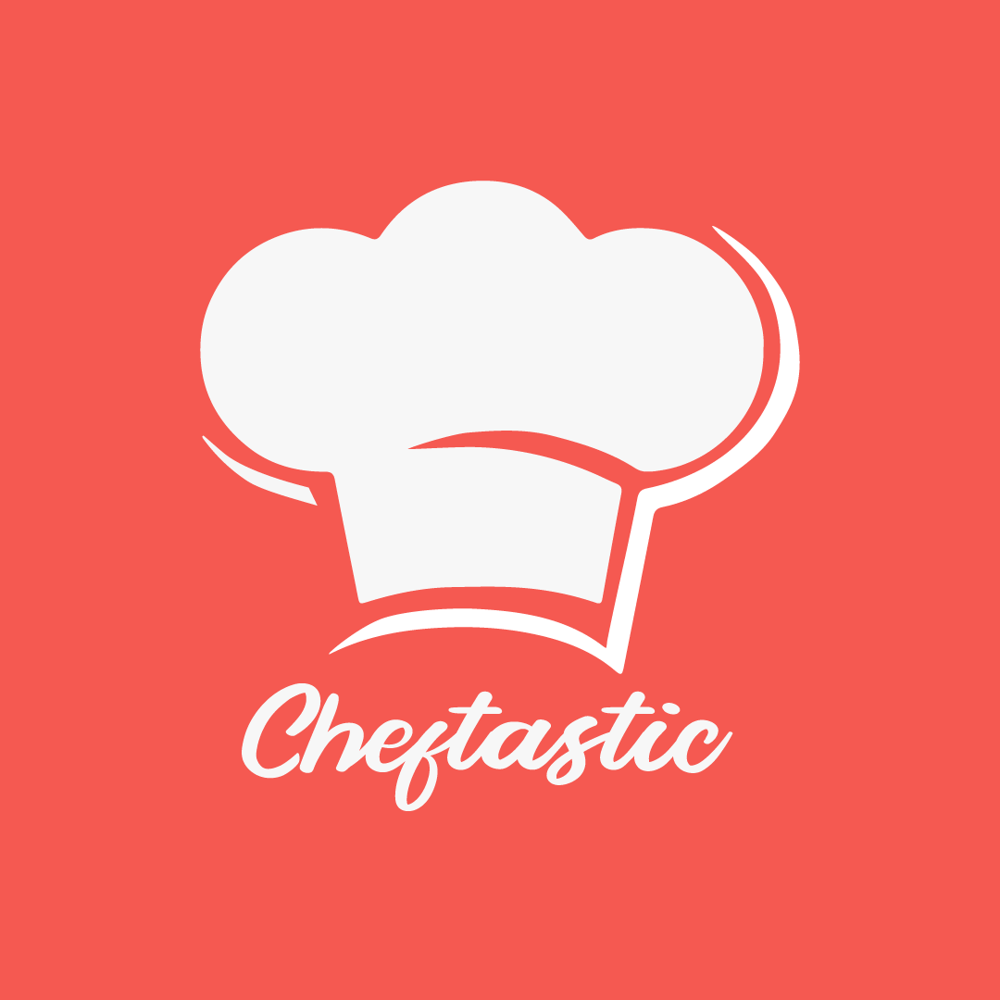

  

# Cheftastic Frontend

Cheftastic is a full stack UGC based application which lets user post and explore recipes from all over the world.

## Prerequisites

- [Node.js > 12](https://nodejs.org) and npm
- [Watchman](https://facebook.github.io/watchman)
- [Xcode 12](https://developer.apple.com/xcode)
- [Cocoapods 1.10.1](https://cocoapods.org)
- [JDK > 11](https://www.oracle.com/java/technologies/javase-jdk11-downloads.html)
- [Android Studio and Android SDK](https://developer.android.com/studio)

## Base dependencies

- [axios](https://github.com/axios/axios) for networking.
- [react-navigation](https://reactnavigation.org/) navigation library.
- [redux](https://redux.js.org/) for state management.
- [redux-persist](https://github.com/rt2zz/redux-persist) as persistance layer.
- [redux-thunk](https://github.com/gaearon/redux-thunk) to dispatch asynchronous actions.
- [@react-native-firebase/messaging](https://www.npmjs.com/package/@react-native-firebase/messaging) for notifications.
- [react-native-fast-image](https://github.com/DylanVann/react-native-fast-image) for image caching

---

## Install

    $ git clone https://github.com/ad-dhawan/cheftastic-frontend.git
    $ cd cheftastic-frontend
    $ npm install

## Configure app

Create and open `/.env` then edit it with your settings. You will need:

- GOOGLE_WEB_CLIENT_ID
- STAGING_URL

## Folder structure

This template follows a very simple project structure:

- `src`: This folder is the main container of all the code inside your application.
  - `assets`: Asset folder to store all images, vectors, fonts, etc.
  - `components`: Folder to store any common component that you use through your app (such as a generic button or image)
  - `navigators`: Folder to store all kind of navigators used in the app.
  - `redux`: Folder to store state management redux files like reduced and store.
  - `screens`: Folder that contains all your application screens/features.
  - `services`: Folder to store the services provided in the app like authentication, deeplinking, networking, etc.
  - `utils`: This folder contains all the constant values that are used in the app like colors, fonts, etc
- `App.js`: Main component that starts your whole app.
- `index.js`: Entry point of your application as per React-Native standards.

## Splash screen customization

To customize the splash screen (logo and background color) use the CLI provided in the [official docs](https://github.com/zoontek/react-native-bootsplash#assets-generation).

---

## Running the project

### to start the metro bundler
    $ npx react-native start

### for android
    $ npm run android
    or
    $ npx react-native run-android

### for iOS
    $ npm run ios
    or
    $ npx react-native run-ios

---

## Generate Production Build

These are the steps to generate `.apk`, `.aab` and `.ipa` files

### for android
1. Generate an upload key
2. Setting up gradle variables
3. Go to the android folder
4. Execute `./gradlew assembleRelease`

### for iOS
1. Go to the Xcode
2. Select the schema
3. Select 'Any iOS device' as target
4. Product -> Archive

For more info please go to https://reactnative.dev/docs/publishing-to-app-store